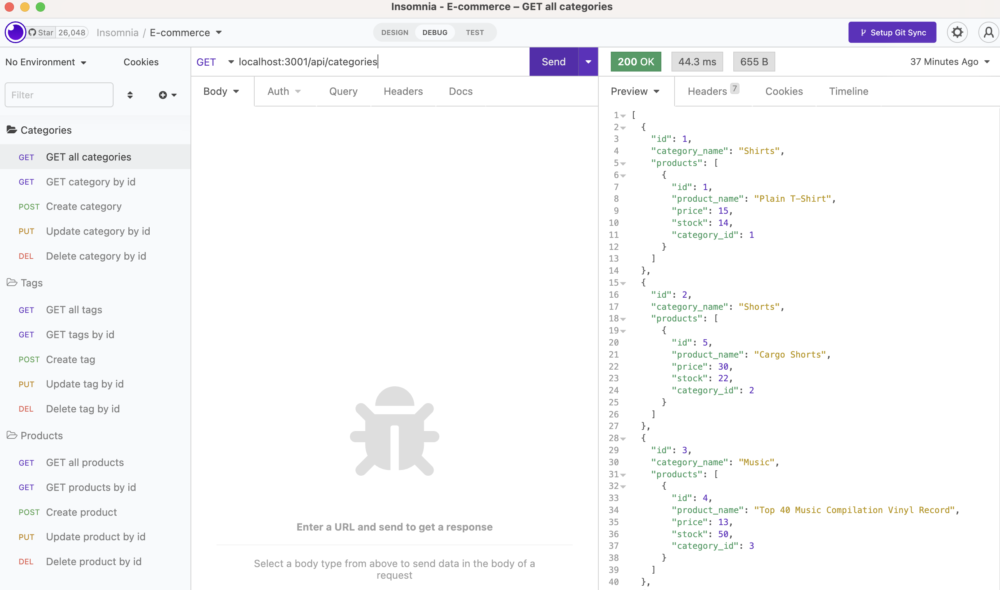

# 13 Object-Relational Mapping (ORM): E-Commerce Back End

## Demonstration
In this e-commerce project, Sequelize models are used and being synced to MySQL data base as the server is started. By using Insomnia, I can post, put, delete routes for categories, products, or tags. 

## Screenshot

## Walkthrough Video
Walkthrough video can be checked from following link: https://drive.google.com/file/d/16X6vp2Ua9D9aXYMcSGBZyriWa4jvnBEz/view?usp=share_link

## Instruction
Follow following process:
* mysql -u root -p
* show databases;
* \q
* node seeds
* npm i
* node server.js
* Run Insomnia and check localhost

## Softwares used
* VS code
* Quick time player & Google drive
* Insomnia